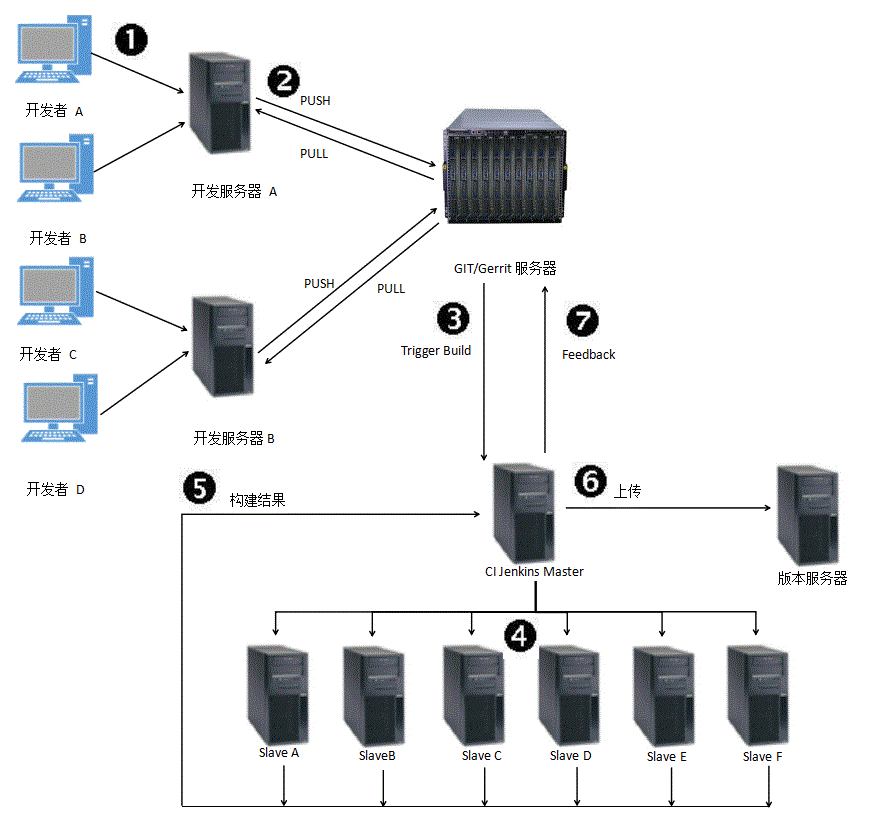

注： 思路还未整理清楚，先把要点罗列一下。

期望： 把公司的开发方法串联起来

# GIT
    Git is a VCS (Version Control System) for tracking changes in computer files 
    and coordinating work on those files among multiple people. It is 
    primarily used for source code management in software development, but
    it can be used to keep track of changes in any set of files. As a 
    distributed revision control system it is aimed at speed, data integrity,
    and support for distributed, non-linear workflows.

    Git was created by Linus Torvalds in 2005 for development of the Linux
    kernel, with other kernel developers contributing to its initial
    development. Its current maintainer since 2005 is Junio Hamano.

    As with most other distributed version control systems, and unlike most
    client–server systems, every Git directory on every computer is a
    full-fledged repository with complete history and full version tracking 
    abilities, independent of network access or a central server.

    Git is free software distributed under the terms of the GNU General 
    Public License version。
# Repo
    Repo (Repository): Google用来管理AOSP (Android Open Source Project)中的众多GIT仓。

# Gerrit
    
    Rietveld: a web-based collaborative code review tool for Subversion 
    written by Guido van Rossum to run on Google's cloud service.   
    
        Gerrit is a fork of Rietveld, another code review tool. 
        Its namesake is Dutch designer Gerrit Rietveld.
        Intention: ACL(Access Control List) patches would not get integrated into Rietveld

    Gerrit is a free, web-based team code collaboration tool. Software 
    developers in a team can review each other's modifications on their 
    source code using a Web browser and approve or reject those changes. It 
    integrates closely with Git, a distributed version control system.

问一下高趁，我们开发中所使用的git服务器与gerrit服务器

# Jenkins

    Jenkins project was forked from Hudson after a dispute with Oracle.

    Jenkins is an open source automation server written in Java. Jenkins 
    helps to automate the non-human part of software development process
    

整个开发流程：

