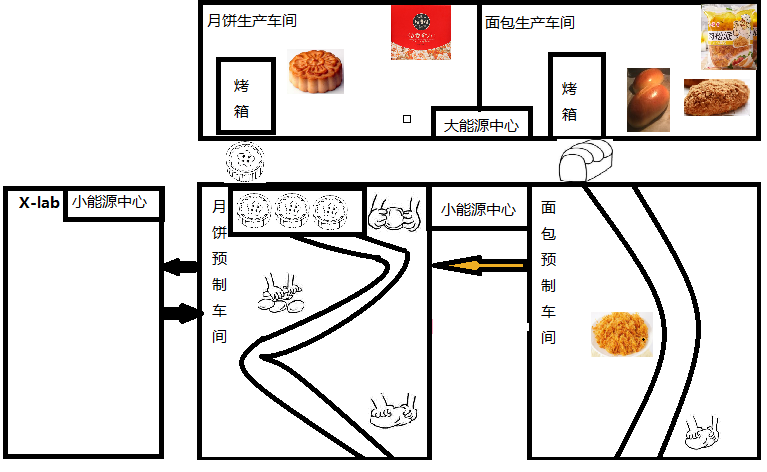

# SwordOfYueWang

越王之剑，成就春秋霸主之业。

今年9月初，交付完一个新特性。回顾整个近半年的开发周期，细细品味其中过程，忆苦思甜。
该特性主要由三人协作完成，从软件开发的角度来看，主要涉及需求收集，基于TDD的开发方法，持续集成等各方面。既定的计划及目标均以达成，因此当前可以做一个理论与实践相结合的案例分析。由于需要对项目进行保密，符合公司的规章制度，所以将会以一个虚构场景进行总结。

在总结之前，自己在利用两周的时间，翻阅了《软件开发方法》《敏捷开发方法》《微服务设计》等经典书籍。最终选择了《微服务设计》一书。

主要考虑以下原因：

* 书中讲述部分微服务理念，非常适合自己所做的项目
* 内容提纲挈领，便于查阅及思考

虚构项目
----
* 月饼与肉松面包的生产过程（纯属杜撰，只为模拟实际项目的流程）
    

生产介绍：
1. 左上为月饼生产车间负责烤月饼（10分钟/每个），并进行礼盒包装；右上边为肉松面包生产车间负责烤面包（2分钟/每个），覆盖肉松，包装。两个车间由大能源车间提供支持
2. 左下为月饼预制车间，负责从原材料调制，和面，月饼成型；右下为面包预测车间，负责原材料调制，肉松制作，面包成型。由于能源需求不大， 所以由小能源车间提供支持。
3. 我主要负责月饼的生产流程。在实际生产过程中，预制车间每生成一个月饼，就送到烤箱中，烤熟后会经过放到包装传送带，由工人进行包装。
4. 经过一段时间的生产，发现由于烤制的时间过长。后面的包装效率非常低。由于预制车间每生产一个月饼就需要打开并放进烤箱，实在是把人类：（
5. 生产效率低下，且能源消耗过大。所以大家讨论后， 决定在月饼预制车间中增加一个保鲜柜，用于存放制作好的月饼。当预制100个（烤箱最大容量）时，一次性放入烤箱，烤熟后启动包装生产线，并在包装完后， 包装生产线下电。这样最大程度提高效率并节能。

* 月饼新生产过程

  

* 成立X实验室

为了迎合市场上不同人的需求，公司成立了X实验室.
1. 负责生产果泥, 提供给月饼预制车间
2. 生产肉松+果泥，提供给月饼预制车间
3. 新品种面点（基于月饼做改进）

PS： 为了不影响月饼的生产，X-lab需要使用较快的速率将果泥及时送到预制车间

  

截止当前描述，就是我要做的事情，总结如下：

1. 优化生产线，提高月饼生产效率，降低功耗
2. 与X-lab合作，使用新口味的果泥做为月饼馅
3. 将面包预制车间的肉松材料，传送给X-lab，用于调制新口味
4. 将预制的月饼传送给X-lab，用于生产新的面点

交流讨论
----
- [submit issue](https://github.com/LoveYakamoz/Quantitative_Trading/issues/new)
- email: yangpei3720@gmail.com